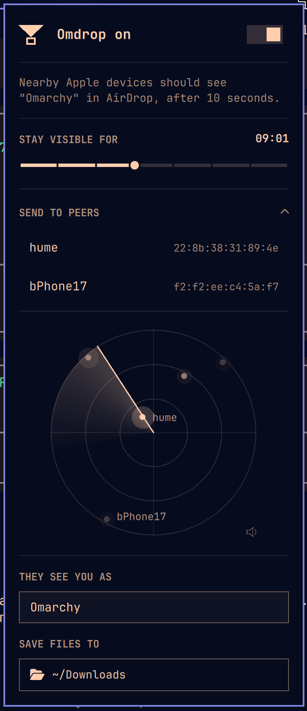

# Omdrop

AirDrop for [Omarchy](https://omarchy.org) Apple Silicon Macs with Broadcom WiFi chips (M1 & M2 machines). Send and receive files with nearby iPhones, iPads, and Macs, in both Everyone and Contacts Only mode.



## Requirements
- **A `brcmfmac` driver with AWDL enabled.** The plugin installs one from [omdrop-awdl](https://github.com/brentkearney/omdrop-awdl) on first use.
- **Broadcom Wi-Fi whose firmware implements AWDL**: see [Hardware Compatibility](https://github.com/brentkearney/omdrop-awdl/blob/main/README.md#hardware-compatibility) on the driver project.

For AirDrop on other hardware, see [OpenDrop](https://github.com/seemoo-lab/opendrop) and [owl](https://github.com/seemoo-lab/owl), which implement AWDL in userspace over monitor mode. [LocalSend](https://localsend.org), which ships with Omarchy, is an open alternative that needs its app on every device.

## Install

```bash
omarchy plugin add https://github.com/brentkearney/omdrop-plugin.git
```

Answer yes when it asks to enable the plugin. The icon, a triangle dropping into a box, appears on the right of the bar. To move it, run `omarchy bar move netmojo.omdrop --section center`.

On first use, the panel opens a terminal that asks for your password to:

- Build and install the driver and the `opendrop` AirDrop library. Both are pinned to exact commits, and `makepkg` verifies the library's source checksum. The library is installed with `--assume-installed owlink`, because Omdrop uses the firmware's AWDL and never runs that daemon.
- Add one firewall rule: TCP 8771 on `awdl0`, from IPv6 link-local addresses only.

First use also installs the `omdrop` command at `~/.local/bin/omdrop`. To get it straight away, run `omdrop setup`. Run `omdrop --version` to include the version in bug reports.

## Receive files

Click the icon to open the panel:

- **The switch** turns receiving on and off. Right-clicking the icon does the same.
- **Stay visible for** sets how long you stay visible: one file, a set time, or until you turn it off.
- **They see you as** sets the name Apple devices show. It defaults to the hostname.
- **Save files to** opens a folder chooser. It defaults to `~/Downloads`.

Received files are saved, copied to the clipboard, and announced in a notification. Clicking the notification opens the file.

## Send files

Expand **Send to peers**, or press `n` in the panel. If Omdrop is off, this turns it on, because the receive window is what hears nearby devices.

- A radar shows each nearby device as a dot. Brighter and nearer the centre means a stronger signal, not a direction or distance.
- Devices that answer with a name are listed under the heading.
- Click a name or any dot, then choose one or more files. They go as one transfer, so the recipient accepts once. The chooser opens in the folder you last sent from. The row shows progress, and an **×** cancels the send.
- Named devices ping as the sweep passes them. The speaker in the radar's corner mutes the sound, and Omdrop remembers the setting.

While the section is open, Omdrop keeps asking devices for their names. Asking connects to each device and briefly announces your Apple ID over Bluetooth, so that Contacts Only devices answer. Closing the section stops it.

The recipient sees a prompt naming this computer, just as they would for an Apple device. A Mac answers right away. An iPhone listens only in short bursts, so Omdrop keeps trying for 30 seconds. Opening a share sheet on the phone wakes it. Sending to a Contacts Only device needs an Apple-issued identity on this machine; without one, set the recipient to **Everyone**.

## Command line

The panel's controls are also commands:

```bash
omdrop on 15                      # visible to everyone for 15 minutes
omdrop on -c 10m                  # Contacts Only, for 10 minutes
omdrop on once                    # until one file arrives
omdrop off
omdrop status
omdrop name "Study Mac"
omdrop dir ~/Drops
omdrop limit 30                   # largest transfer, as % of free disk space
omdrop peers -n                   # nearby devices, with names
omdrop send ~/photo.jpg MyMac     # by name, or --to part of an address
omdrop send ~/a.jpg ~/b.pdf MyMac # several files, accepted once
omdrop send --wait 120 ~/photo.jpg iPhone
omdrop send --verbose ~/photo.jpg # protocol log, for bug reports
```

`start`, `stop`, `list`, and `vis` are aliases for `on`, `off`, `peers`, and `visibility`. Run `omdrop help` for the rest.

In `omdrop peers -n` output, `(no response)` means nothing answered on the AirDrop port, and `(anonymous)` means the device answered but withheld its name. To look up names without the Bluetooth announcement, add `--no-wake`; only devices already listening will answer. AWDL addresses change every session.

## Contacts Only

To accept files only from people you choose:

```bash
omdrop senders add you@icloud.com   # an Apple ID email or phone number
omdrop visibility contacts
omdrop visibility everyone          # back to the default
```

A sender is accepted only if Apple's signature on their identity record is valid, the record matches the certificate on the connection, and one of its identifiers is on your list. Anyone else is refused before any file data is read. An empty list refuses everyone.

Senders not on your list also don't see you in their share sheet. This hiding is best-effort. Identity isn't bound to the connection at discovery, so someone replaying a known contact's record can see you, but still can't send. A device that sends no verifiable identity is shown, and is refused when it tries to send.

The list is stored in plain text so you can edit it. Identifiers are hashed for comparison and never logged.

Each transfer is capped at 30% of free disk space by default, and at least 1 GiB is always left free. To change the cap, run `omdrop limit PERCENT` with a value from 1 to 90.

## Privileges

The radio helper, `/usr/lib/omdrop/omdrop-discoverable`, runs as root through `pkexec`, because configuring AWDL needs vendor commands and raw frame transmission. The polkit action `org.omarchy.omdrop.discover` covers only that root-owned path. It needs no password from your own active session, and an administrator's password from remote or inactive sessions. The driver package installs both.

The receiver runs as you, so received files are yours. The firewall rule is added with `sudo ufw` in the install terminal, which normally reuses the driver install's authentication.

## Remove

```bash
omdrop firewall remove
omarchy plugin remove netmojo.omdrop
sudo pacman -R brcmfmac-awdl-dkms
```

## Known limitations

- Folders can't be sent. Compress one first.
- iOS shows a refused Contacts Only transfer as "Waiting..." rather than an error.

## Contributing

To report a bug or request a feature, [open an issue](https://github.com/brentkearney/omdrop-plugin/issues). [Pull requests](https://github.com/brentkearney/omdrop-plugin/pulls) are welcome.

## Trademark

"AirDrop" is a trademark of Apple Inc. Omdrop is an independent project, not affiliated with or endorsed by Apple.

## License

MIT. See [LICENSE](LICENSE).
