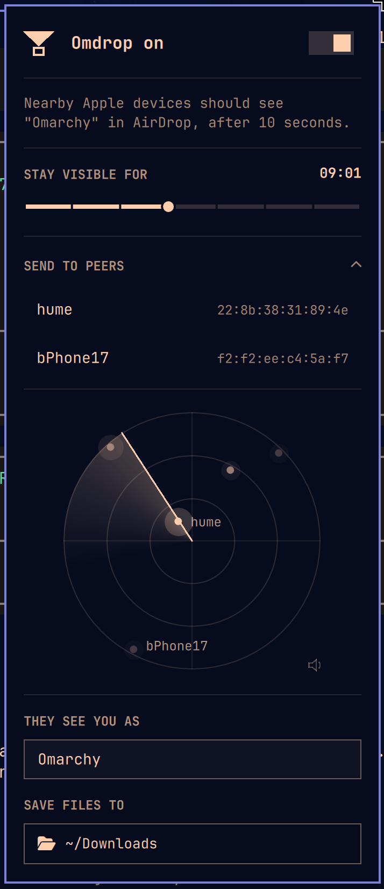

# Omdrop

AirDrop for [Omarchy](https://omarchy.org) Apple Silicon Macs with Broadcom WiFi chips (M1 & M2 machines). Send and receive files with nearby iPhones, iPads, and Macs, in both Everyone and Contacts Only mode.



## Requirements
- **A `brcmfmac` driver with AWDL enabled.** The plugin installs one from [omdrop-awdl](https://github.com/brentkearney/omdrop-awdl) on first use.
- **Broadcom Wi-Fi whose firmware implements AWDL**: see [Hardware Compatibility](https://github.com/brentkearney/omdrop-awdl/blob/main/README.md#hardware-compatibility) on the driver project.

For AirDrop on other hardware, see [OpenDrop](https://github.com/seemoo-lab/opendrop) and [owl](https://github.com/seemoo-lab/owl), which implement AWDL in userspace over monitor mode. [LocalSend](https://localsend.org), which ships with Omarchy, is an open alternative that needs its app on every device.

## Install

```bash
omarchy plugin add https://github.com/brentkearney/omdrop-plugin.git
```

Answer yes when it asks to enable the plugin. The icon, a triangle dropping into a box, appears on the right of the bar. To move it, run `omarchy bar move netmojo.omdrop --section center`.

On first use, the panel opens a terminal that asks for your password to:

- Build and install the driver, pinned to an exact commit, and install `python-libarchive-c` from the official Arch repositories if it is missing. It is the receiver's only library outside Python's standard library.
- Add one firewall rule: TCP 8771 on `awdl0`, from IPv6 link-local addresses only.

The first time you turn Omdrop on, it finishes setting up and installs the `omdrop` command at `~/.local/bin/omdrop`. To get the command before that, run `~/.config/omarchy/plugins/netmojo.omdrop/bin/omdrop setup`. Run `omdrop --version` to include the version in bug reports.

## Upgrade

```bash
omarchy plugin update netmojo.omdrop   # fetch the latest release
omarchy-restart-shell                  # the bar loads the new panel only after a shell restart
omdrop install-driver                  # rebuild the driver if the new release needs a newer one
```

`omdrop install-driver` does nothing when the installed driver is already current. If Omdrop is on while you upgrade, turn it off and on again: the receiver keeps running the old version until it restarts.

## Receive files

Click the icon to open the panel:

- **The switch** turns receiving on and off. Right-clicking the icon does the same.
- **Stay visible for** sets how long you stay visible: one file, a set time, or until you turn it off.
- **They see you as** sets the name Apple devices show. It defaults to the hostname.
- **Save files to** opens a folder chooser. It defaults to `~/Downloads`.

Received files are saved, copied to the clipboard, and announced in a notification. Clicking the notification opens the file.

A shared link arrives as a `.url` or `.webloc` file. Clicking its notification, or double-clicking it in Files, opens it in your browser. Only `http` and `https` links open; a link to anything else, such as `file://` or `smb://`, is refused with a notification, because it was chosen by whoever sent it.

## Send files

Expand **Send to peers**, or press `n` in the panel. If Omdrop is off, this turns it on, because the receive window is what hears nearby devices.

- A radar shows each nearby device as a dot. Brighter and nearer the centre means a stronger signal, not a direction or distance.
- Devices that answer with a name are listed under the heading.
- Click a name or any dot, then choose one or more files. They go as one transfer, so the recipient accepts once. The chooser opens in the folder you last sent from. The row shows progress, and an **×** cancels the send.
- Named devices ping as the sweep passes them. The speaker in the radar's corner mutes the sound, and Omdrop remembers the setting.

While the section is open, Omdrop keeps asking devices for their names. Asking connects to each device and briefly announces your Apple ID over Bluetooth, so that Contacts Only devices answer. Closing the section stops it.

The recipient sees a prompt naming this computer, just as they would for an Apple device. A Mac answers right away. An iPhone listens only in short bursts, so Omdrop keeps trying for 30 seconds and, while it waits, announces this computer over Bluetooth to wake the phone's AirDrop receiver. If the phone still doesn't answer, opening a share sheet on it wakes it. Sending to a Contacts Only device needs an Apple-issued identity on this machine; without one, set the recipient to **Everyone**.

## Command line

The panel's controls are also commands:

```bash
omdrop on 15                      # visible to everyone for 15 minutes
omdrop on -c 10m                  # Contacts Only, for 10 minutes
omdrop on once                    # until one file arrives
omdrop off
omdrop status
omdrop name "Study Mac"
omdrop dir ~/Drops
omdrop limit 30                   # largest transfer, as % of free disk space
omdrop peers -n                   # nearby devices, with names
omdrop send ~/photo.jpg MyMac     # by name, or --to part of an address
omdrop send ~/a.jpg ~/b.pdf MyMac # several files, accepted once
omdrop send --wait 120 ~/photo.jpg iPhone
omdrop send --verbose ~/photo.jpg # protocol log, for bug reports
```

`start`, `stop`, `list`, and `vis` are aliases for `on`, `off`, `peers`, and `visibility`. Run `omdrop help` for the rest.

In `omdrop peers -n` output, `(no response)` means nothing answered on the AirDrop port, and `(anonymous)` means the device answered but withheld its name. To look up names without the Bluetooth announcement, add `--no-wake`; only devices already listening will answer. AWDL addresses change every session.

## Contacts Only

To accept files only from people you choose:

```bash
omdrop senders add you@icloud.com   # an Apple ID email or phone number
omdrop visibility contacts
omdrop visibility everyone          # back to the default
```

The panel shows the same choice as **Everyone** and **Contacts Only** tabs under the timer. You can set it while Omdrop is off, and it is saved, so it applies every time you turn Omdrop on.

The people button at the right of that line opens the known-senders list, with the number of senders beside it. Type an email address or phone number and press Enter to add someone; click a sender to remove them. Changes apply to the next transfer, with no restart.

A sender is accepted only if Apple's signature on their identity record is valid, the record matches the certificate on the connection, and one of its identifiers is on your list. Anyone else is refused before any file data is read. An empty list refuses everyone.

Senders not on your list also don't see you in their share sheet. This hiding is best-effort. Identity isn't bound to the connection at discovery, so someone replaying a known contact's record can see you, but still can't send. A device that sends no verifiable identity is shown, and is refused when it tries to send.

The list is stored in plain text so you can edit it. Identifiers are hashed for comparison and never logged.

Each transfer is capped at 30% of free disk space by default, and at least 1 GiB is always left free. To change the cap, run `omdrop limit PERCENT` with a value from 1 to 90.

## Your AirDrop identity

Apple devices recognize this computer by its AirDrop identity: a certificate, its private key, and, for Contacts Only, your Apple ID validation record. Omdrop uses one of three:

| Identity | Where it lives | Who can see this computer |
|---|---|---|
| Self-signed | `~/.omdrop/keys/certificate.self-signed.pem` and `key.self-signed.pem`, created automatically | Devices set to Everyone |
| Apple, on disk | `~/.omdrop/keys/certificate.pem`, `key.pem`, `validation_record.cms` | Everyone, and Contacts Only devices whose owner has you as a contact |
| Apple, in 1Password (recommended) | A 1Password item; cached in memory while in use | The same as on disk |

Run `omdrop identity` to see which one is in use.

### Keep your Apple identity in 1Password

Your Apple identity's private key lets anyone holding it present themselves as you to nearby Apple devices. Keeping it in 1Password takes it off disk. Omdrop fetches it when you turn Omdrop on, keeps it in the kernel's memory for 12 hours, and receives without asking again during that time.

1. Install the [1Password CLI](https://developer.1password.com/docs/cli/get-started/) and open the 1Password app.
2. In 1Password, turn on **Settings → Security → Unlock using system authentication** and **Settings → Developer → Integrate with 1Password CLI**. A polkit authentication agent must be running for 1Password to show its prompt.
3. Move the identity:

   ```bash
   omdrop identity 1password import
   ```

   This creates a 1Password item, **Omdrop AirDrop identity**, reads it back, and deletes the files from `~/.omdrop/keys` only when 1Password holds an identical copy. Add `--vault NAME` to choose a vault. On another computer, `omdrop identity 1password use ITEM` uses the same item.

The first `omdrop on` afterwards asks 1Password for the identity. If 1Password isn't running, is locked, or you dismiss its prompt, that window uses the self-signed identity and a notification says so; Contacts Only devices won't see this computer until the next window that has your identity.

When Omdrop asks 1Password for the identity, 1Password asks whether to allow the request and may then ask you to confirm through system authentication, such as your computer's login password or fingerprint, because of the setting in step 2. If you approved a request recently, 1Password may not ask at all. Omdrop asks only when you turn it on without a cached identity, or run `omdrop identity unlock`, `omdrop identity 1password import` or `omdrop identity 1password use`; don't approve a request you didn't start.

| Command | What it does |
|---|---|
| `omdrop identity unlock` | Fetch now, for example when you log in, so the prompt doesn't come mid-task. |
| `omdrop identity lock` | Turn Omdrop off and clear the cached identity. The next `omdrop on` asks again. |
| `omdrop identity 1password off` | Stop using 1Password. The item stays in 1Password. |

To change how long the identity stays cached, set `identity_cache_hours=` (1 to 24) in `~/.config/omdrop/settings`. A window can hold the identity past that, up to 24 hours after it was fetched; after 24 hours Omdrop turns off.

What the cache does and doesn't protect against:

- The cached identity lives in kernel memory, isn't written to a file, and is gone after a reboot or when it expires. Logging out doesn't clear it if your account has systemd lingering enabled.
- Any program running as you, and root, can read it, just as they could read a file only you can open. Linux has no per-app protection like the macOS keychain's.
- While Omdrop is receiving, the receiver holds the key in its own memory. Omdrop keeps it out of core dumps, and `identity lock` stops the receiver before clearing the cache.

## Privileges

The radio helper, `/usr/lib/omdrop/omdrop-discoverable`, runs as root through `pkexec`, because configuring AWDL needs vendor commands and raw frame transmission. The polkit action `org.omarchy.omdrop.discover` covers only that root-owned path. It needs no password from your own active session, and an administrator's password from remote or inactive sessions. The driver package installs both.

The receiver runs as you, so received files are yours. The firewall rule is added with `sudo ufw` in the install terminal, which normally reuses the driver install's authentication.

The AirDrop identity is kept in `~/.omdrop/keys`, or in 1Password; see [Your AirDrop identity](#your-airdrop-identity). If `~/.opendrop/keys` exists and `~/.omdrop` doesn't, Omdrop copies it there once and leaves the original in place for OpenDrop.

Protocol dumps for bug reports are off by default. `omdrop send --verbose` writes them to `$XDG_RUNTIME_DIR/omdrop/debug`, with validation records and certificates replaced by their size.

## Remove

```bash
omdrop firewall remove
omdrop links remove
omarchy plugin remove netmojo.omdrop
sudo pacman -R brcmfmac-awdl-dkms
omdrop identity lock                # clear a cached identity
rm -rf ~/.omdrop                    # this computer's AirDrop identity
```

## Known limitations

- Folders can't be sent. Compress one first.
- iOS shows a refused Contacts Only transfer as "Waiting..." rather than an error.

## Contributing

To report a bug or request a feature, [open an issue](https://github.com/brentkearney/omdrop-plugin/issues). [Pull requests](https://github.com/brentkearney/omdrop-plugin/pulls) are welcome.

## Trademark

"AirDrop" is a trademark of Apple Inc. Omdrop is an independent project, not affiliated with or endorsed by Apple.

## License

MIT. See [LICENSE](LICENSE).
